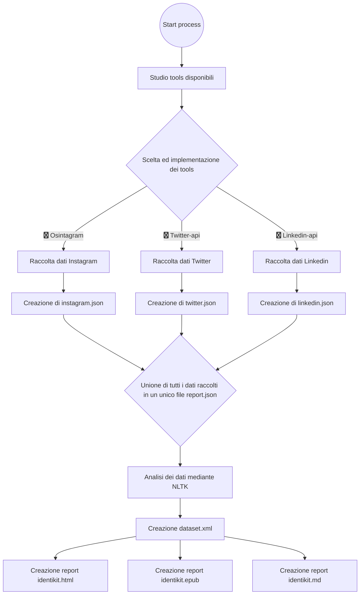
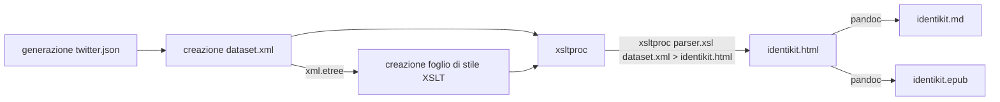
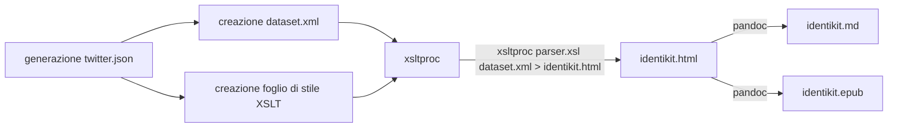

#	Open Source Intelligence, identikit builder


## Introduzione

L'Open Source Intelligence è una disciplina che si pone l'obbiettivo di collezionare e analizzare dati da fonti pubblicamente accessibili(open source).

L'Osint trova utilizzi in tantissimi settori tra cui i principali sono:

- Sicurezza informatica
- Campo Legale
- Business Intelligence
- Profilazione

La disciplina è quindi molto vasta, scopo del mio progetto sarà quello della profilazione di account social sfruttando diverse tecniche.

## Obbiettivi

L'obbiettivo sarà capire quali sono gli argomenti principali che un individuo tratta su un social network e ulteriormente individuare eventuali casi di hate speech o linguaggio d'odio.

Al termine verrà generato un report in tre diversi formati:

- epub
- markdown
- html

Il report sarà un identikit, contenente tutte le informazioni trovate sui vari social network dove l'individuo è stato cercato.

## Processo di produzione


### Studio e analisi tema

L'osint riguarda la collezione e analisi di dati raccolti da fonti pubblicamente accessibili (open source).[^5]

Queste fonti possono essere di svariati tipi e categorie:

- *Media* 
  - giornali
  - radio
  - televisione
- *Internet*
  - Blogs
  - social media(twitter, instagram ecc)
  - Web sites
- Dati Governamentali
  - Report pubblicamente accessibili scaricabili da siti governamentali
- Pubblicazioni accademiche
- Grey literature

In base alle fonti dalle quali si decide di raccogliere i dati possono esserci almeno 4 grandi categorie di osint:

- Social Media Osint
  - I dati vengono raccolti da Social Media
- Email Osint
  - L'obbiettivo è: data una email scoprire il maggior numero di informazioni riguardanti il proprietario della email.
  - Esistono diversi tools come *sharlock* [^9] che permettono di trovare tutti i siti web su cui l'email è stata utilizzata per la registrazione
  - Se la email è g-mail si possono trovare molte più informazioni, come il nome, il cognome ed eventuali recensioni lasciate su google maps utilizzando un tool chiamato *Ghunt* [^10]
  - Esistono diverse basi di dati, come quella *Have I been Pawned* [^11] Dove è possibile scovare eventuali password associate alla email
- Mobile Phone Osint
- Cybersecurity Osint

A prescindere dal tipo di Osint che si intende intraprendere l'obbiettivo resta sempre lo stesso: **Raccogliere il maggior numero di dati/informazioni e analizzarli**


### Tools esistenti

Esistono molti tools per le diverse tecniche di Osint.

In base anche alle competenze dell'investigatore questi tools possono essere principalmente di 2 tipi:

- Tools da linea di comando
- Tools con interfaccia
- Query di ricerca direttamente nell'url


#### Tools da linea di comando

- Nmap[^6]
  - Questo potentissimo tools esiste anche con una versione provvista di GUI che tuttavia non è una "release ufficiale" e non presenta tutte le funzionalità di nmap
  - Nmap viene utilizzato per il *Cybersecurity Osint* 
- Osintagram[^7]
  - E' un tool da linea di comando basato su Selenium
  - Permette di effettuare diverse query di ricerca su Instagram
  - Per funzionare bisogna fornigli le credenziali per un valido account instagram. Il tool utilizzerà queste credenziali per ottenere un cookie che servirà per eseguire tutte le altre query di ricerca
  - E' *rischioso* da utilizzare, in quanto Instagram non è favorevole all'utilizzo di bot. Quindi se si esagera con le query l'account potrebbe venir bloccato
  - Permette di ottenere diverse informazioni utili per il *Social Media Osint* :
    - Immagini caricate dall'account
    - Eventuali commenti lasciate dall'account sotto i post
    - La posizione da dove l'account ha caricato i post
- Linkedin-api[^8]
  - E' una libreria di "Wrapped api" di Linkedin.
  - Usando questa libreria si possono ottenere praticamente tutte le informazioni consultabili online come:
    - Il livello e i titoli di istruzione del target
    - Le eventuali esperienze lavorative
    - Eventuali post e foto caricate dal target
- Twitter-api[^3]
  - Twitter è l'unico social network che fornisce delle api pubblicamente accessibili.
  - Queste api permettono letteralmente di fare tutto con un account twitter, si potrebbe infatti anche creare un account twitter completamente automatizzato, in grado di scrivere in automatico tweets, postare foto e rispondere ai commenti. Quindi anche per quanto riguarda l'osint, utilizzando queste Api si possono ottenere tutte le informazioni riguardanti un account
- Natural Language Toolkit[^4]
  - si tratta di una famosa libreria di Python che permette di analizzare classificare, fare stemming e taggare parole
  - Viene utilizzata per analizzare e classificare i dati
  - è quindi possibile:
    1. Tokenizzare ed evidenziare le parole più utilizzate
    2. Analizzare le frasi

### Definizione di Target

Il target sono persone che hanno un minimo di conoscenza per riuscire ad invocare uno script shell. E' quindi richiesto un sistema operativo Unix

Per poter fare la ricerca sarà infatti sufficiente eseguire lo script *./Osint.sh* in una console.
Al termine verrà generato un report in 3 diversi formati:

-	epub
-	html
-	md


### Studio competitor

Non sono riuscito a trovare nessun tool/competitor che raggiunga già l'obbiettivo che mi sono proposto.

Esistono tuttavia alcuni competitor molto noti nel campo del social media osint, tra questi i principali sono:


- [People-data-labs](https://www.peopledatalabs.com/) , probabilmente è l'azienda più famosa nel capo del social OSINT, ha un enorme dataset di persone che si può consultare tramite chiamate API. 
  I dataset sono costruiti per lo più prendendo informazioni da profili facebook, quindi in alcuni casi è possibile risalire anche al numero di telefono della persona cercata, è a pagamento, ed il costo è molto *gravoso*.

-	[True people search](https://truepeoplesearch.com/) è un famoso website che permette di fare query di ricerca su persone.

  Contiene dati solo su persone statunitensi e non è accessibile da fuori gli USA, ha un pool molto ristretto di informazioni accessibili gratuitamente, in generale è comunque un tool abbastanza *povero*, bisogna essere molto fortunati per trovare quello che si sta cercando.

-	[Fast people search](https://www.fastpeoplesearch.com/), come True people search ma presenta un dataset più *ricco*

-	[Nuwber](https://nuwber.com/) come i tools precedenti, anche questo purtroppo è accessibile solo con IP americano

  

  

  

## Flusso di gestione documentale

​	

 




## Tecnologie adottate


Una volta creato il file *twitter.json* devo adottare delle tecnologie che mi permettano di produrre un "Identikit" del profilo social in formati leggibili e gradevoli.

*In questa foto viene mostrata una parte del file twitter.json*


Ho scelto di produrre l'identikit in 3 formati diversi:

- html
- epub
- markdown




### Produzione identikit.html

La mia idea è stata subito quella di utilizzare XSLT per produrre il file *identikit.html*


Per fare questo bisogna convertire *twitter.json* in *dataset.xml*  → Per fare questo sembra basti semplicemente usare uno script xsl : si potrebbe infatti usare una funzione chiamata *json-to-xml()*

La funzione viene documentata qui: [json-to-xml()](https://www.saxonica.com/html/documentation10/functions/fn/json-to-xml.html) ma per utilizzarla bisogna usare [Saxon](https://www.saxonica.com/documentation12/documentation.xml) [^1]


Ho preferito quindi usare una libreria python chiamata *xml.etree* [^12] perchè mi permette di avere un maggior controllo sulla trasformazione.

Qui è rappresentato il codice python usato per aggiungere il contenuto di *twitter.json* nel file *dataset.xml*

```python
import json as j
import xml.etree.cElementTree as e
with open("twitter.json") as json_format_file:
    d = j.load(json_format_file)


r = e.Element("Account")


e.SubElement(r,"name").text = d["name"]
e.SubElement(r,"description").text = d["description"]
e.SubElement(r,"current_status").text = d["current_status"]["text"]

e.SubElement(r,"profileImage").text = d["profile_image_url"]
for status in d["statuses"]:
    #print(status)
    s = e.SubElement(r,"Status")
    e.SubElement(s,"text").text = status

for status in d["offensiveLanguage"]:
    #print(status)
    s = e.SubElement(r,"offensiveLanguage")
    e.SubElement(s,"text").text = status    

try:
    for status in d["hateLanguage"]:
        #print(status)
        s = e.SubElement(r,"hateLanguage")
        e.SubElement(s,"text").text = status    

except:
    print("no offensive")

a = e.ElementTree(r)
a.write("json_to_xml.xml")
```

Questo è il risultato senza *identazione*:


Una volta ottenuto il file *dataset.xml* posso usare XSLT per produrre il documento *identikit.html*:

```xml
<?xml version="1.0" encoding="utf-8"?>
<xsl:stylesheet version="1.0" xmlns:xsl="http://www.w3.org/1999/XSL/Transform"
    xmlns:msxsl="urn:schemas-microsoft-com:xslt" exclude-result-prefixes="msxsl"
>
  <xsl:output method="html" indent="yes"/>
  <xsl:template match="/">
    <html>
      <head>
      </head>
      <body>
            <div style="display:flex; justify-content:center">
                
                    <xsl:attribute name="src">
                        <xsl:value-of select="Account/profileImage"/>
                    </xsl:attribute>
                </img>

                <h1>Search results for <xsl:value-of select="Account/name" /> on twitter</h1>
            </div>

            <ul>
                <li> <p>Description: <xsl:value-of select="Account/description"/></p>    </li>
                <li>      <p>Current status: <xsl:value-of select="Account/current_status"/></p>    </li>
            </ul>
   
            


            <div style=" max-width: 1000px;margin:auto">
                <h2 style="text-align:center;    background-color: #a6d5ff;margin-bottom: 0;">Last 400 status:</h2>
                <div style="max-height:65%; overflow:auto; padding:40px;background-color: aliceblue; padding-top:0!important;   ">
                    <xsl:for-each select="Account/Status">
                        <p><xsl:value-of select="text"/></p>
                        <hr></hr>
                    </xsl:for-each>
                </div>
            </div>


            <div style=" max-width: 1000px;margin:auto">
                <h2 style="text-align:center;    background-color: #ff4e4e;margin-bottom: 0;">Offensive language detected:</h2>
                <div style="max-height:60%; overflow:auto; padding:40px;background-color: #ffedef; padding-top:0!important;   ">
                    <xsl:for-each select="Account/offensiveLanguage">
                        <p><xsl:value-of select="text"/></p>
                        <hr></hr>
                    </xsl:for-each>
                </div>
            </div>

            <br></br>

            <div style=" max-width: 1000px;margin:auto">
                <h2 style="text-align:center;    background-color: #ff4e4e;margin-bottom: 0;">Hate language detected:</h2>
                <div style="max-height:60%; overflow:auto; padding:40px;background-color: #ffedef; padding-top:0!important;   ">
                    <xsl:for-each select="Account/hateLanguage">
                        <p><xsl:value-of select="text"/></p>
                        <hr></hr>
                    </xsl:for-each>
                </div>
            </div>
           
           
      
            

      </body>
    </html>
  </xsl:template>
</xsl:stylesheet>
```

Il risultato è questo:


### Generazione del report in formato .md

Una volta creato il report in formato html, posso usare pandoc[^2] per generare il file *identikit.md*

Utilizzo il parametro *gfm-raw_html* per evitare che pandoc[^2] mi inserisca anche tutte le regole *style* all'interno di markdown 

```bash
pandoc -o output.md -t gfm-raw_html dest.html
```


### Generazione del report in formato .epub

Una volta che si disponde del report in formato .md è facile tramite pandoc ottenere un file *identikit.epub*, basta infatti eseguire questo comando:

```shell
pandoc dest.html -o libro.epub
```


Sui sistemi Linux è molto difficile trovare un epub reader di qualità; l'unico che sembra attualmente disponibile si chiama, [Calibre](https://calibre-ebook.com/) ; dopo averlo installato sarà quindi possibile visualizzare il libro

Allego sotto alcune immagini del *report.epub* ottenuto tramite gli step descritti sopra


Pandoc[^2] permette di convertire facilmente .md in .epub tuttavia si potrebbero aggiungere molte modifiche per rendere il libro più gradevole.

Si possono ad esempio introdurre molti metadati, di seguito mostro quelli che ho personalmente aggiunto in un file nominato *meta.xml*:

```xml
<dc:language>en</dc:language>
<dc:author>Luca Stoian</dc:author>
<dc:title>Social media open source Intelligence report</dc:title>
<dc:date>2023</dc:date>
```

quindi eseguendo questo comando si potrà generare il libro elettronico con i metadati specificati sopra:

```shell
pandoc dest.html -o libro.epub --epub-cover-image copertinaLibro.jpeg --epub-metadata=meta.xml
```

Se si desidera customizzare ulteriormente il libro, sarà necessario unzippare il file .epub ed editarne manualmente i contenuti.

### Automatizzare il processo

L'idea è quindi quella di creare uno shell script che esegua tutti questi comandi in automatico.

Lo script chiedera all'utente di inserire il nome di una persona da cercare su twitter, una volta trovata la persona farà un analizi di hate speech + offensive language e genererà i vari report dei formati indicati sopra.





```shell
read -p 'Nome: ' nome

read -p 'Cognome: ' cognome
echo $nome $cognome

python3 twitterData.py $nome $cognome
python3 twitterXSLTtransofrmation.py
xsltproc twitterXSLTparser.xsl json_to_xml.xml > dest.html
sleep 2
pandoc -o output.md -t gfm-raw_html dest.html
pandoc dest.html -o libro.epub --epub-cover-image copertinaLibro.jpeg --epub-metadata=meta.xml

```


## Conclusioni


Il risultato ottenuti sono molto soddisfacenti:

Eseguendo un semplice file di shell è possibile ottenere un identikit di un profilo social in diversi formati.

La visualizzazioni del report nei formati epub, html e md è molto gradevole e soddisfacente.

Tuttavia è emerso un limite nell'automatizzazione della trasformazione dati, sopratutto per quanto riguarda la creazione del report in formato epub:

- Pandoc converte abbastanza bene passando da html a epub, tuttavia non permette di gestire bene l'impaginazione: Capita molto spesso che i vari capitoli e scritte vengano separate in due pagine diverse.

  Per risolvere questo problema, l'unico modo sembra quello di unzippare il file epub e di editare i vari *XHTML* secondo le proprie esigenze 
  
- Difficoltà nel convertire json in formato xml, si potrebbe fare usando XSLT con Saxon [^1] ma la documentazione non è per niente chiara

Per il momento i vari report contengono solo i dati ottenuti tramite Twitter, nel prossimo futuro verranno aggiunti anche i dati prelevati tramite Instagram e Linkedin


## Bibliografia e Sitografia


[^1]: https://www.saxonica.com/html/documentation10/functions/fn/json-to-xml.html	"Saxonica"
[^2]: https://pandoc.org/	"Pandoc"
[^3]: https://developer.twitter.com/en/docs/twitter-api	"Twitter Api"
[^4]: https://www.nltk.org/	"Natural Language Toolkiti"
[^5]: Open Source Intelligence techniques di Michael Bazzell
[^6]: https://nmap.org/	"Nmap"
[^7]: https://github.com/Datalux/Osintgram	"Osintagram"
[^8]: https://developer.linkedin.com/	"Linkedin-api"
[^9]: https://github.com/sherlock-project/sherlock	"Sharlock"
[^10]: https://github.com/mxrch/GHunt	"Ghunt"
[^11]: https://haveibeenpwned.com/	"Have I been pawned"
[^12]: https://docs.python.org/3/library/xml.etree.elementtree.html	"Xml.etree"
